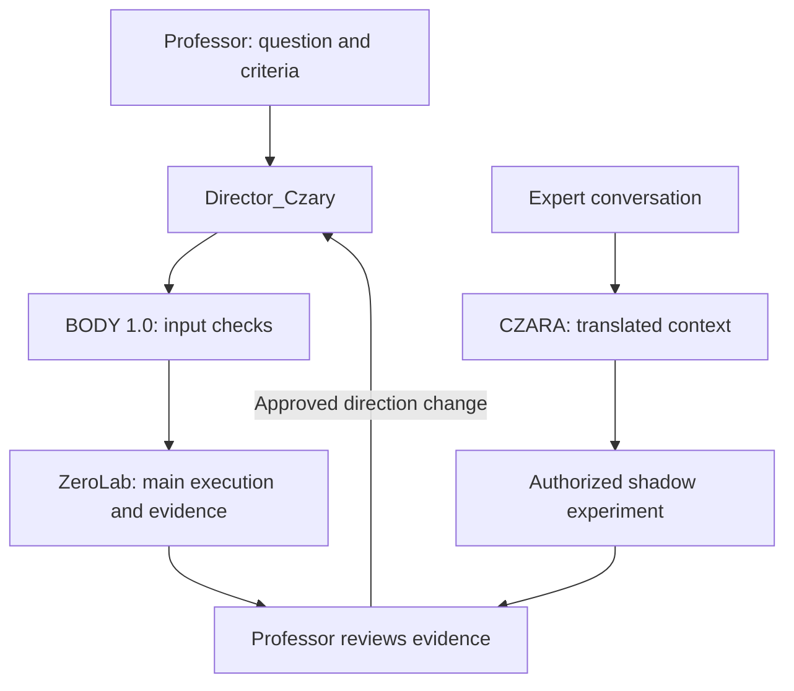

# CZARA — current status, ZeroLab and the research workflow

**Updated:** 2026-10-07  
**Role:** current entry point for CZARA, Director_Czary and BODY_FROZEN_1_0.  
**Public scope:** architecture and bounded software evidence; private implementation remains private.

CZARA's first internal curriculum is complete. The later ZeroLab V2 extension now provides a bounded local experiment path for BODY_FROZEN_1_0, alongside the separate SSI Final scope. These are distinct evidence families: the original curriculum's qualification does not automatically qualify the new ZeroLab procedures.

## Origin and early contributor attribution

The current CZARA line was not developed in complete isolation from outside input. **Amnezja / [@amnezja3](https://github.com/amnezja3) (Mikael)** is credited by the SSI author/operator as an **early CZARA co-creator / seed contributor**: he introduced the initial direction and performed the first connection step that brought CZARA into the SSI work. Paweł Jankiewicz subsequently developed and expanded CZARA into its present SSI V5 role, training path, Director_Czary/ZeroLab workflow and Universal Lab integration.

This is a scoped historical credit. It does not assign Amnezja authorship of SSI V5 as a whole, and the repository does not invent an unverified GitHub profile URL. See [External review feedback and attribution](EXTERNAL_REVIEW_FEEDBACK_AND_ATTRIBUTION_20260929.md).

## Universal Lab / Director_Czary preparation update — 2026-10-07

The current Universal Lab workstream adds an installed authenticated meeting gate and a prepared SSI knowledge path for CZARA / Director_Czary.

Current preparation records:

- **345,961 indexed SSI documents**;
- **1,432 prepared curriculum cases**;
- **48 selected `DIRECTOR_SSI_V5_TO_DIRECTOR_CZARA` artifacts**;
- **48 selected `BODY_FROZEN_SSI_V5_TO_BODY_FROZEN_CZARA` artifacts**;
- knowledge state **INDEX_READY**;
- qualification **NOT_RUN**.

This is a prepared redirection/knowledge-routing path from the existing SSI material into the CZARA research scope. It does **not** mean that every private skill has already been live-qualified or that all native Universal Lab bridges are already active.

The installed R3 Universal Lab configuration contains a local Ollama translation bridge. A recent operator-side test reported roughly **2 seconds** for the local translation step on the MSI GV62-8RE host. The integration is intentionally resource-bounded for i7 / 16 GB RAM / GTX 1060 6 GB VRAM with local qwen3:4b.

R5 is the next step for live binding/verification of DIRECTOR, CZARA/Shadow, Router V10/Micronetwork telemetry, BODY_FROZEN execution, ZeroLab validation and the shared partner meeting timeline.

- [Universal Lab — Partner Meeting Start Here](UNIVERSAL_LAB_MEETING_START_HERE_20261007.md)
- [Detailed Universal Lab status](SYSTEM/SSI_UNIVERSAL_LAB_STATUS_20261007.md)

## Status at a glance

| Track | Current evidence | Boundary |
|---|---|---|
| First CZARA curriculum | 160/160 final checkpoint PASS; 520/520 skills qualified | Specific internal curriculum |
| Frozen evaluation | 24 validation + 16 Champion runs PASS / REUSE | Learning disabled during these 40 evaluations |
| ZeroLab V2 local pilot | BODY_FROZEN_1_0 PASS, included in 8/8 executor pilot | Local record-transformation fixture; zero model calls; no training qualification |
| Professor chat, expert observation, shadow and approved main revision | Implemented workflow described in the reviewed V2 source | Complete conversational sequence not established by the pilot |
| External Mexico benchmark | Planned research workflow | External execution and physical validation not claimed |
| Separate SSI Final recovery | First batch: 5 PASS / 2 INCONCLUSIVE; later batch: 4 PASS / 3 INCONCLUSIVE and infrastructure stop | Neither batch is a CZARA curriculum result |

Sources: [first curriculum](CZARA_FIRST_TRAINING_CYCLE_RESULTS_20261001.md), [ZeroLab pilot](ZERO_LAB_V2_FIRST_RESULTS_20261002.md), [latest Final stop](RESULTS/SSI_FINAL_RECOVERY_STOP_20261002.md).

## Who does what

| Participant | Responsibility |
|---|---|
| Professor / authorized local operator | Defines the objective, criteria and authorized changes to the main experiment |
| Director_Czary | Coordinates the CZARA-side experiment and delegates input checks and execution |
| BODY_FROZEN_1_0 | Checks completeness and executes a supported local laboratory method |
| CZARA | Preserves original and translated research context, roles and chronology; prepares authorized shadow alternatives |
| Expert | Supplies observations or alternative methods under the experiment's authority policy |
| Student / observer | Provides context without acquiring authority to change frozen criteria |

Director_Final, Final BODY_FROZEN and ISKRA1–ISKRA6 form the separate Final scope. They are not aliases for Director_Czary or BODY_FROZEN_1_0.

## Experiment and shadow workflow

The following describes the implemented design, not a claim that the full sequence has passed an external benchmark:

Missing inputs remain explicit. The protocol and candidate method are versioned separately. A shadow proposal requires a focused experiment and the relevant permission; conversational content alone does not authorize execution. Selecting a shadow direction creates a new main execution while preserving the earlier branch and its evidence.

ZeroLab's current local adapters operate on supplied records or an existing native micronetwork artifact. The published pilot exercises the record adapter. It does not prove native-micronetwork performance or the ability to build arbitrary physical laboratories.

## What is confirmed and what remains to test

The operator-provided pilot output reports nine services READY: eight executors and Director_Final. BODY_FROZEN_1_0 returned PASS. Director_Czary was not a separate member of that readiness check, so 9/9 must not be presented as a readiness result for both Directors.

The next end-to-end evaluation should bind one professor request, input-completeness result, frozen protocol, main execution, expert proposal, shadow receipt and authorized new main execution into one evidence chain. It should preserve missing translations, missing inputs, invalid methods and rejected authority changes. Results are not preclaimed.

## Consolidation boundary

Shared ZeroLab infrastructure does not create automatic joint consolidation across CZARA, both Directors and both BODY identities. The selected Final recovery runner does not perform automatic stage consolidation. The regular full-stage Final workflow has its own verified-subset consolidation path; read-only access to its hints is not a bidirectional memory merge.

## Evidence and review

- [First curriculum results](CZARA_FIRST_TRAINING_CYCLE_RESULTS_20261001.md) and [537 sanitized run records](evidence/CZARA_FIRST_TRAINING_20261001/README.md)
- [ZeroLab architecture and authority](SYSTEM/ZERO_LAB_V2_ARCHITECTURE_AND_AUTHORITY_20261002.md)
- [ZeroLab first results](ZERO_LAB_V2_FIRST_RESULTS_20261002.md) and [public evidence pack](evidence/ZERO_LAB_V2_20261002/README.md)
- [Latest separate Final recovery stop](RESULTS/SSI_FINAL_RECOVERY_STOP_20261002.md)
- [Current research roadmap](CURRENT_RESEARCH_ROADMAP_20261002.md)
- [Historical LAB_ARCHITECT proposal](CZARA_ZERO_LAB_LAB_ARCHITECT_MODULE_20261001.md)

The new pilot and recovery exports are based on supplied terminal output. Export-consistency checks do not establish original runtime-signature verification, independent replication or physical validation.
