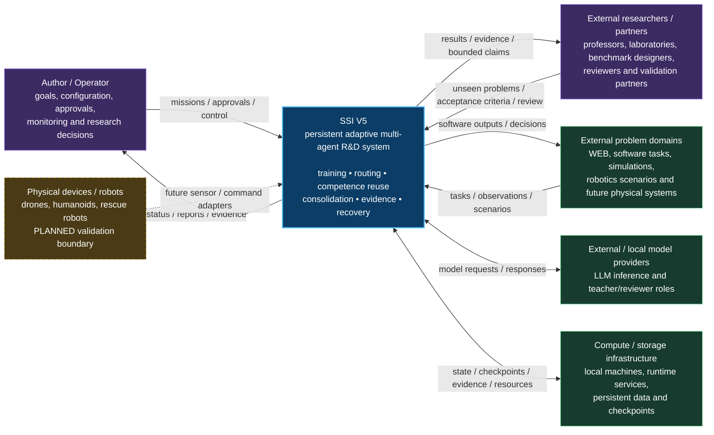

# SSI V5 — C4 Architecture

**Role:** canonical public architecture map / single source of truth  
**C4 scope:** Level 1 — System Context, Level 2 — Containers, Level 3 — Components  
**Created:** 2026-10-07  
**Implementation boundary:** proprietary code, credentials, reconstructive runtime internals and private prompts are intentionally excluded.  
**Evidence boundary:** architecture and status labels do not create new experimental claims. Completed, current, ready, installed, pre-build and planned states must remain distinct.

> **Maintenance rule — one file only:** this document is the canonical current architecture view of SSI V5.  
> When SSI architecture changes, update **this file** instead of copying new architecture diagrams into README, reviewer, roadmap or status documents.  
> Other current documents should link here. Older dated architecture files remain preserved as historical snapshots and are not retroactively rewritten.

## How to read this file

This document deliberately separates:

- **what SSI V5 is connected to** — C4 Level 1;
- **which major runtime/application boundaries exist** — C4 Level 2;
- **how a bounded task moves through the core decision/evidence path** — C4 Level 3.

Status tags used below:

- **CURRENT** — part of the present public architecture;
- **COMPLETED EVIDENCE** — bounded evidence has been published for that scope;
- **INSTALLED / NOT COMPLETED** — infrastructure exists, but the declared curriculum/result is not yet claimed complete;
- **READY / NOT COMPLETED** — preparation exists, but successful live completion is not yet claimed;
- **PRE-BUILD** — specified architecture, not claimed as an integrated completed module;
- **PLANNED** — future validation or physical integration, not claimed complete.

---

# C4 Level 1 — System Context

This level shows SSI V5 as one system and the people/systems around it.



## Context boundary

SSI V5 is not presented here as a single LLM. It is a persistent software ecosystem that coordinates separately identified agents, routing, competence storage, evidence, validation and recovery.

The public architecture does **not** claim:

- AGI, sentience or consciousness;
- production readiness;
- safety certification;
- completed physical robot validation;
- completed independent external replication.

---

# C4 Level 2 — Containers

This level shows the major runtime/application boundaries. The two most important separation rules are:

1. **DIRECTOR / SSI Final scope remains distinct from the CZARA research-collaboration scope.**
2. **BODY_FROZEN and BODY_FROZEN_1.0 are not treated as the same runtime identity merely because they can share compatible infrastructure or competence.**

```mermaid
flowchart TB
    subgraph UI["Human / Partner Interface"]
        reviewer["Public research portal / reviewer view<br/>CURRENT — observer / evidence boundary"]
        operator_ui["Operator control / monitoring<br/>CURRENT"]
        universal["Universal Lab<br/>R3 INSTALLED / R5 INTEGRATION<br/>partner meeting + benchmark environment"]
    end

    subgraph FINAL["SSI Final Runtime Scope"]
        director_final["Director_Final<br/>mission orchestration / planning / adjudication"]
        body_final["BODY_FROZEN<br/>persistent execution body"]
        iskras["ISKRA1 .. ISKRA6<br/>separate persistent agent identities"]
        dynamic["Dynamic Mission V6<br/>INSTALLED / NOT COMPLETED"]
        web["WEB engineering path<br/>READY / NOT COMPLETED"]
    end

    subgraph CZARA_SCOPE["CZARA Research Collaboration Scope"]
        czara["CZARA<br/>conversation/research context<br/>first internal curriculum: COMPLETED EVIDENCE"]
        director_czary["Director_Czary<br/>research protocol / orchestration"]
        body10["BODY_FROZEN_1.0<br/>research execution / translation owner"]
        zerolab_c["ZeroLab — CZARA scope<br/>CURRENT bounded laboratory runtime"]
    end

    subgraph ROUTING["Routing / Competence Access"]
        v10["Router V10<br/>state/history/failure-aware routing"]
        s10["Router S10<br/>specialized competence routing layer"]
        micro["Micronetworks<br/>persistent validated competence"]
        champs["Candidate → Challenger → Champion<br/>qualification lifecycle"]
        blocks["BLOCKS family<br/>Pocket / Space / Navigator / Content / META-BLOCKS"]
    end

    subgraph LABS["Execution / Laboratory Layer"]
        zerolab_f["ZeroLab — Final scope<br/>CURRENT bounded laboratory runtime"]
        domain["Domain / World adapters<br/>software and simulation-facing"]
        mexico["Mexico / external partner benchmark path<br/>PLANNED external execution"]
    end

    subgraph EVIDENCE["Persistence / Evidence / Recovery"]
        evidence["Evidence + provenance<br/>PASS / INCONCLUSIVE / FAIL preserved"]
        continuum["CONTINUUM<br/>missions / checkpoints / evidence continuity"]
        state["Persistent state / memory / checkpoints"]
        recovery["Rollback / recovery / replay controls"]
    end

    subgraph EXTERNAL["External Dependencies"]
        llms["Local + external LLM providers"]
        infra["Compute / storage / IPC / runtime services"]
        robots["Physical robots / devices<br/>PLANNED validation"]
    end

    operator_ui --> director_final
    operator_ui --> director_czary
    reviewer --> evidence
    universal -.-> czara
    universal -.-> director_czary
    universal -.-> body10

    director_final --> v10
    director_final --> s10
    director_final --> body_final
    director_final --> iskras
    dynamic --> director_final
    web --> body_final
    web --> iskras

    czara --> director_czary
    director_czary --> body10
    director_czary --> zerolab_c

    v10 <--> micro
    s10 <--> micro
    micro <--> champs
    micro <--> blocks

    v10 --> body_final
    v10 --> iskras
    s10 --> body_final
    s10 --> iskras

    body_final --> zerolab_f
    iskras --> zerolab_f
    body10 --> zerolab_c

    zerolab_f --> domain
    zerolab_c --> domain
    domain -.-> mexico
    domain -.-> robots

    director_final --> evidence
    director_czary --> evidence
    body_final --> evidence
    iskras --> evidence
    body10 --> evidence
    zerolab_f --> evidence
    zerolab_c --> evidence

    evidence <--> continuum
    evidence <--> state
    recovery <--> state
    recovery --> v10
    recovery --> s10

    director_final <-->|"inference / review"| llms
    director_czary <-->|"inference / review"| llms
    body_final <-->|"inference"| llms
    iskras <-->|"inference"| llms
    body10 <-->|"translation / inference"| llms

    FINAL <-->|"runtime resources"| infra
    CZARA_SCOPE <-->|"runtime resources"| infra
    EVIDENCE <-->|"persistent storage"| infra

    classDef current fill:#0b3d66,stroke:#55c2ff,color:#fff;
    classDef competence fill:#154a35,stroke:#67d391,color:#fff;
    classDef evidenceClass fill:#5a2449,stroke:#ff83cd,color:#fff;
    classDef planned fill:#4a3b16,stroke:#f0c04f,color:#fff,stroke-dasharray: 5 5;
    classDef prebuild fill:#44205e,stroke:#c58cff,color:#fff,stroke-dasharray: 5 5;

    class director_final,body_final,iskras,czara,director_czary,body10,zerolab_c,zerolab_f,reviewer,operator_ui current;
    class v10,s10,micro,champs,blocks competence;
    class evidence,continuum,state,recovery evidenceClass;
    class dynamic,web,mexico,robots planned;
    class universal prebuild;
```



## Container ownership and separation

### SSI Final

The SSI Final scope contains the primary Director, BODY_FROZEN and six ISKRA actors. These actors are evaluated as separately identified persistent entities rather than one interchangeable worker pool.

### CZARA scope

CZARA, Director_Czary and BODY_FROZEN_1.0 form a separate research-collaboration path. This scope is used to develop controlled Human-AI research interaction, laboratory protocol preparation, contextual assistance and the planned multilingual Universal Lab.

### Universal Lab integration boundary

Universal Lab has moved beyond architecture-only planning: **Live Gate R3 / 1.1.1 is installed** as the authenticated web/session baseline. ZeroLab V2 already exists as a bounded laboratory/runtime layer, while the SSI knowledge-preparation path for CZARA / Director_Czary is **INDEX_READY / NOT QUALIFIED** with **345,961 indexed documents** and **1,432 prepared curriculum cases**.

The R3 configuration includes a local Ollama translation bridge. A recent operator-side host test reported roughly **2 seconds** for the local translation step on the development machine. The target machine is deliberately modest — MSI GV62-8RE, i7, 16 GB RAM, GTX 1060 6 GB VRAM — so the meeting stack is being designed local-first and resource-bounded rather than assuming a datacenter GPU.

R5 is the next integration/verification layer for the shared Conference timeline, DIRECTOR interaction, CZARA/Shadow, Router V10/Micronetwork telemetry and timings, BODY_FROZEN execution visibility, ZeroLab live validation and meeting evidence. Not every native SSI bridge is yet claimed live-bound through the R3 gate.

See [Universal Lab — Partner Meeting Start Here](UNIVERSAL_LAB_MEETING_START_HERE_20261007.md) and [detailed Universal Lab status](SYSTEM/SSI_UNIVERSAL_LAB_STATUS_20261007.md).

### Shared infrastructure does not imply shared identity

The following can be shared or made compatible without merging runtime identities:

- compute;
- model providers;
- storage infrastructure;
- evidence formats;
- adapters;
- compatible competence transfer mechanisms.

A common provider, host or database does not by itself prove cross-agent learning or consolidation.

### Public/private boundary

This diagram intentionally exposes **roles and relationships**, not reconstructive implementation details. Public evidence may contain sanitized logs, hashes, summaries, state counts and verification tools while private implementation remains private.

---

# C4 Level 3 — Core Components and Execution Flow

This level explains the bounded execution loop without publishing proprietary code.

```mermaid
flowchart LR
    input["1. Task / Mission Input<br/>goal + context + acceptance criteria"]
    plan["2. Director Planning<br/>decompose / assign / set constraints"]
    route["3. Routing Decision<br/>V10 / S10<br/>REUSE • VERIFY • ADAPT • FULL_FLOW"]
    competence["4. Competence Selection<br/>Micronetwork / Champion / BLOCKS<br/>or new candidate path"]
    execute["5. Execution<br/>BODY / selected ISKRA / laboratory adapter"]
    validate["6. Validation<br/>declared checks / reviewer / comparison"]
    verdict{"7. Verdict"}
    evidence["8. Evidence + Provenance<br/>inputs • outputs • hashes • receipts • history"]
    promote["9A. Controlled Promotion<br/>candidate → challenger → champion<br/>only when gates permit"]
    recover["9B. Recovery / Re-route<br/>failure signature • alternate route<br/>rollback / escalation"]
    inconclusive["9C. Preserve INCONCLUSIVE<br/>do not silently convert to PASS"]
    result["10. Result / Report<br/>bounded claim + current state"]

    input --> plan --> route --> competence --> execute --> validate --> verdict
    verdict -->|"PASS"| evidence
    verdict -->|"INCONCLUSIVE"| inconclusive --> evidence
    verdict -->|"FAIL"| evidence

    evidence -->|"qualified reusable result"| promote
    evidence -->|"failure / mismatch / low confidence"| recover
    recover --> route

    promote --> result
    evidence --> result

    classDef step fill:#0b3d66,stroke:#55c2ff,color:#fff;
    classDef routing fill:#154a35,stroke:#67d391,color:#fff;
    classDef evidenceClass fill:#5a2449,stroke:#ff83cd,color:#fff;
    classDef recoveryClass fill:#5b2b1e,stroke:#ff9b71,color:#fff;
    classDef verdictClass fill:#4a3b16,stroke:#f0c04f,color:#fff;

    class input,plan,execute,validate,result step;
    class route,competence,promote routing;
    class evidence,inconclusive evidenceClass;
    class recover recoveryClass;
    class verdict verdictClass;
```



## Core component responsibilities

| Component | Public architectural responsibility |
|---|---|
| **Director** | mission planning, decomposition, orchestration, policy/acceptance control and result coordination |
| **Router V10** | state/history/outcome-aware route selection, confidence gating, failure-aware recovery and anti-blind-retry behavior |
| **Router S10** | specialized access/routing over qualified competence and task paths |
| **Micronetworks** | persistent reusable competence units whose lifecycle can be evaluated and promoted |
| **Candidate / Challenger / Champion** | explicit qualification lifecycle rather than treating every generated behavior as trusted skill |
| **BLOCKS** | modular competence/task composition layer used to decompose and recombine bounded capabilities |
| **BODY_FROZEN / BODY_FROZEN_1.0** | persistent execution bodies in distinct runtime scopes |
| **ISKRA1..6** | separate persistent agent identities used for independent learning/execution comparisons |
| **CZARA** | research-conversation context, structured assistance and controlled shadow research support |
| **ZeroLab** | bounded experiment/protocol execution layer with explicit authority and evidence boundaries |
| **Evidence / provenance** | preservation of outcomes, including failures and inconclusive states, with verification-oriented records |
| **CONTINUUM** | continuity across missions/checkpoints/evidence rather than treating every run as isolated |
| **Recovery / rollback** | controlled return, reroute, retry or escalation after detected failure/mismatch |

---

# Canonical execution principles

## 1. Reuse is conditional

```text
HIGH CONFIDENCE + VALID CONTEXT + QUALIFIED COMPETENCE
-> REUSE

AMBIGUOUS / MEDIUM CONFIDENCE
-> VERIFY / TOP-K / ADDITIONAL CHECK

LOW CONFIDENCE / UNKNOWN / CONFLICT
-> FULL_FLOW
```

## 2. Known failure should affect the next route

```text
COMPARABLE STATE
+ SAME FAILURE SIGNATURE
+ SAME ROUTE
+ NO NEW EVIDENCE

=> DO NOT BLINDLY REPEAT
```

The recovery path can select another competence, alter the BLOCKS composition, request verification, roll back to a checkpoint or escalate to a fuller execution path.

## 3. Evidence is not the same as promotion

A result can be recorded without becoming reusable trusted competence.

```text
RESULT
-> EVIDENCE
-> REVIEW / VALIDATION
-> QUALIFICATION GATE
-> OPTIONAL PROMOTION
```

This distinction is central to current evidence-safety work.

## 4. INCONCLUSIVE remains a first-class state

SSI V5 intentionally preserves unresolved outcomes instead of rewriting them as success. An INCONCLUSIVE result can trigger diagnosis, repair, rerouting or later retest while retaining its original provenance.

## 5. Separate actors remain separately measurable

BODY_FROZEN and ISKRA1..6 can be compared under the same curriculum while retaining separate state, routing history, skill lifecycle and recovery behavior. Later consolidation may be measured as a separate phase rather than silently mixed into the first comparison.

---

# Current architecture status map

This table is a **pointer**, not a replacement for the evidence documents.

| Area | Current architectural status |
|---|---|
| Persistent SSI Final actors | **CURRENT** |
| Director_Final / BODY_FROZEN / ISKRA1..6 separation | **CURRENT** |
| Router V10 / S10 competence routing | **CURRENT / development-validated in bounded published tests** |
| Micronetwork lifecycle | **CURRENT** |
| BLOCKS competence composition | **CURRENT** |
| Evidence / provenance / rollback concepts | **CURRENT** |
| CZARA first internal curriculum | **COMPLETED EVIDENCE** |
| ZeroLab V2 bounded local runtime | **CURRENT / bounded pilot evidence published** |
| Dynamic Mission V6 | **INSTALLED / curriculum completion not claimed** |
| WEB engineering curriculum | **READY / live completion not claimed** |
| Universal Lab | **R3 INSTALLED baseline / R5 live integration in progress** |
| External Mexico benchmark | **PLANNED / not yet claimed executed** |
| Physical drone / humanoid / rescue-robot validation | **PLANNED / not claimed** |
| Independent multi-partner replication | **PLANNED / not claimed** |

For live evidence and current research status, use the repository's current truth/evidence documents. This C4 file should explain **structure**, not duplicate rapidly changing experimental counts.

---

# Update policy — keep architecture maintainable

When architecture changes:

1. **Edit this file only** for the C4 diagrams and architecture descriptions.
2. Update the **Created / last architectural review date** if the architecture itself changes materially.
3. Keep status words conservative: CURRENT, COMPLETED EVIDENCE, INSTALLED, READY, PRE-BUILD or PLANNED.
4. Do not copy these diagrams into other Markdown files.
5. Do not rewrite older dated architecture/evidence documents; they are historical records.
6. Other documents may link to a specific evidence result, but the current structural map should point back here.
7. If a new subsystem becomes important enough to appear in multiple current documents, add it here first and link to this file elsewhere.

## Stable link for other repository documents

Use this exact relative link:

```markdown
[SSI V5 — C4 Architecture](SSI_V5_C4_ARCHITECTURE.md)
```

This keeps future architecture maintenance concentrated in one place.

---

# Relationship to historical architecture documents

Dated architecture documents in the repository remain valuable because they show how SSI evolved. They should be interpreted as historical snapshots for their recorded dates.

**Current architecture pointer:** this file.  
**Historical snapshots:** preserved, not retroactively synchronized.

That distinction prevents a change in SSI V5 from requiring edits across dozens of old research records.
